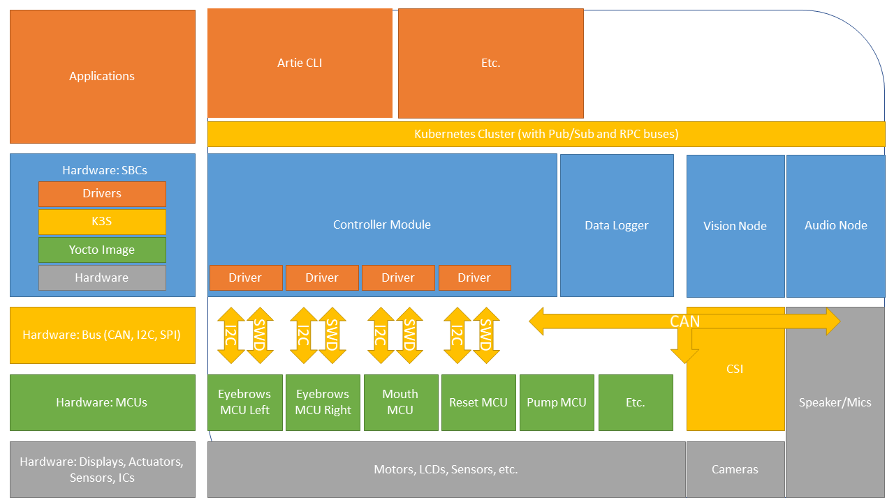

# Architecture Overview (Physical Robot)

At the very top level, any robot built using the Artie Framework will be composed
of some physical components (screws, PCBs, framing, etc.), firmware running in MCUs
(microcontroller units), and software running on single board computers (SBCs).

## Specific Design Choices

### Physical Layer

Let's go through the diagram in detail, starting from the bottom.

First, we have the physical hardware layer. This layer consists of sensors, actuators, LCD displays, and
various integrated circuits (ICs) that need controlling.

These various components can broadly be separated into the following categories, which we
will be referencing throughout the documentation:

* **Sensors**: Sensors *produce* data, such as temperature, humidity, pressure, acceleration, etc.
               Some sensors produce personally-identifiable data (PII), such as cameras and microphones.
               This data needs special considerations in terms of security. See the [security overview page](./security.md)
               for further details.
* **Actuators**: Actuators *consume* data and transform it into physical movements. In an Artie instance, there may be motors,
                 pumps, speakers, etc.
* **Displays**: Displays *consume* data and transform it into physical displays on screens or LEDs, etc.
* **Miscellaneous**: There may be other physical level components (that aren't MCUs - which we will get to shortly),
                     such as a pump controller IC, but these do not need much discussion.

### MCUs (Microcontroller Units)

In the Artie design paradigm, almost the entire physical layer is separated from the rest of the hardware by means of MCUs,
which interface with the various sensors, actuators, etc. This frees up the larger processing units
to do more interesting work, rather than managing sensors and motors constantly. It also makes for a
much more responsive system, as MCUs are typically programmed to be fairly deterministic/real-time.

There are a few exceptions to this design choice however. Notably, microphones, speakers, and cameras
will often have direct connection to the more powerful SBC nodes for lower latency or higher throughput.

### Buses

The next layer up is the bus layer. Any robot using Artie framework makes use of a few different hardware buses,
but the main one to talk about here is CAN.

All Artie designs should try to use CAN for routing messages between MCUs and SBCs.
CAN is a super low-level protocol, so the Artie Framework provides a library in C and Python
that breaks out four higher-level protocols for bulk transfers of data, pub/sub messaging,
real time delivery of small messages, and RPC calls.
See [the CAN protocol details](https://github.com/ArtieBots/ArDK/blob/main/docs/specifications/CANProtocol.md)
for more details.

### SBCs (Single Board Computers)

The bridge between the physical Artie robot's hardware and the software stack that sits on top is found
in the single board computers. Each one runs a custom Yocto image with K3S to allow for control by means
of Kubernetes. This allows almost all the software in the system to be swappable on the fly, so you
don't have to take Artie apart to upgrade him (unless you need to upgrade a physical component, such as a motor).
It also makes the software pinned to a known combination of builds, which in turn makes experiments reproducible
and shareable.
