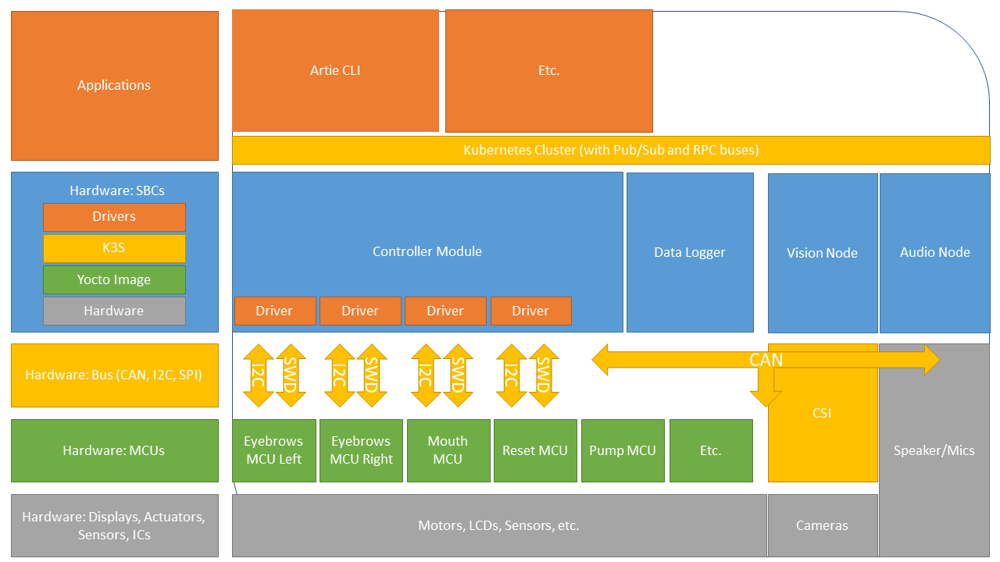

# Architecture Overview

At the very top level, Artie is composed of a physical robot (Artie proper),
a default application stack, and various tools and other ecosystem components.

See the below diagram for a high-level overview of how the first two parts
fit together:

## Specific Design Choices

### Physical Layer

Let's go through the diagram in detail, starting from the bottom.

First, we have the physical hardware layer. This layer consists of sensors, actuators, LCD displays, and
various ICs that need controlling. Each component has a datasheet that can be found
in its PCB's folder inside the [electrical-schematics folder](../../electrical-schematics/README.md).

These various components can broadly be separated into the following categories, which we
will be referencing throughout the documentation:

* **Sensors**: Sensors *produce* data, such as temperature, humidity, pressure, acceleration, etc.
               Some sensors produce personally-identifiable data (PII), such as cameras and microphones.
               This data needs special considerations in terms of security. See the [security overview page](./security.md)
               for further details.
* **Actuators**: Actuators *consume* data and transform it into physical movements. In Artie, there are motors,
                 a pump, and a speaker.
* **Displays**: Displays *consume* data and transform it into physical displays on screens or LEDs, etc.
                In Artie, these are eyebrows, mouth, and a general Artie health monitor screen.
* **Miscellaneous**: There are other physical level components (that aren't MCUs - which we will get to shortly),
                     such as the pump controller IC, but these do not need much discussion.

### MCUs

In Artie, almost the entire physical layer is separated from the rest of the hardware by means of MCUs,
which interface with the various sensors, actuators, etc. This frees up the larger processing units
to do more interesting work, rather than managing sensors and motors constantly. It also makes for a
much more responsive system, as MCUs are typically programmed to be fairly deterministic/real-time.

There are a few exceptions to this design choice however. Notably, the microphones, speaker, and cameras
have direct connections to their single board computers. This is for latency/throughput reasons.

### Buses

The next layer up is the bus layer. Artie makes use of a few different hardware buses, but the main ones are:

* **CAN**: Almost all the SBCs and MCUs are on the CAN bus. We make use of several different protocols
           on top of the CAN layer to ensure data delivery. See [the CAN protocol details](../sdk/CANProtocol.md)
           for more details.
* **I2C**: Some MCUs are peripherals on an I2C bus with the controller node SBC acting as controller.
           This is mostly due to legacy reasons, but is also for physical dimension constraint reasons as well.

### SBCs

The bridge between the physical Artie robot's hardware and the software stack that sits on top is found
in the single board computers. Each one runs a custom Yocto image with K3S to allow for control by means
of Kubernetes. This allows almost all the software in the system to be swappable on the fly, so you
don't have to take Artie apart to upgrade him (unless you need to upgrade a physical component, such as a motor).
