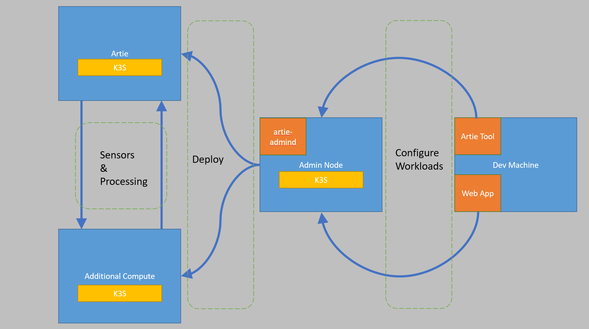

# Architecture Overview

An Artie Framework robot is composed of the following pieces:

* A development machine, which you use to develop experiments and workloads.
* An admin server, which is important for all the overhead stuff
that shouldn't be wasting the robot's on-board resources.
* Optional additional compute nodes, which provide additional processing power.
* And of course, Artie (or whatever you call your robot) himself.
