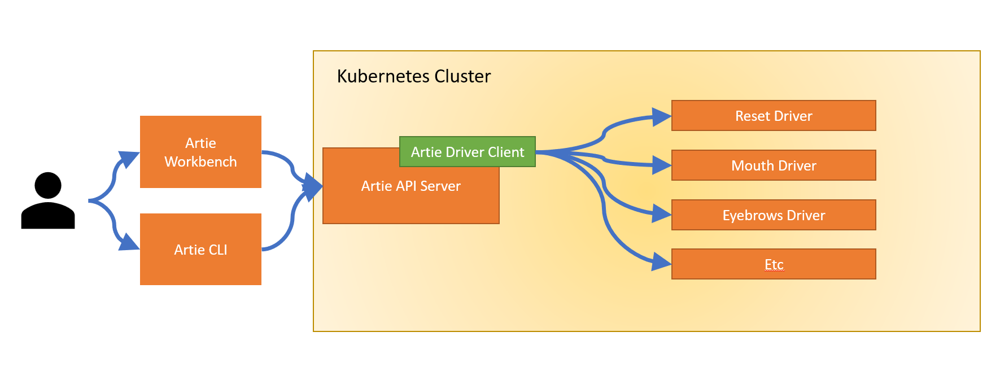

# Edge Deployment

Under this model of deployment:

- You own, operate, and maintain Artie's hardware
- Artie compute required for administration is owned, operated, and maintained by you in the same network as Artie
- Any additional compute required for experiments or workload is provided by you locally in the same network as Artie

**Artie is under development, and this option is not available yet**

## Prerequisites

* An Artie robot that has been built and flashed with the latest firmware and OS images
    - [See here for instructions on how to do this](../building/building-artie-main.md)
* An admin server. This can be any computer that is on the same network as Artie.
    - [See here for instructions on how to install what you need on the admin server](./admin-server.md)
* Any additional computers you want to add to the Artie system.
    - [See here for instructions on how to install what you need on additional compute servers](./compute-server.md)
* A dev machine. This can be the admin server or a compute node, but you may want to keep it separate.
  Either way, you'll need to make sure that you have the following installed:
    - Python 3.11+
    - [Kubectl](https://kubernetes.io/docs/tasks/tools/) - v1.32
    - [Helm](https://helm.sh/docs/intro/quickstart/) - 4.0 (don't install Kubernetes separately - Artie comes prepackaged with it)
    - If you haven't already, make sure to install the Python dependencies for Artie Tool after cloning this repo:
      `pip install -r requirements.txt` from the 'framework' directory of the repo.

## Turn Artie on for the First Time

TODO: The following steps need to have screenshots and some additional details.

It's now time to turn Artie on and configure him so that the admin server, your dev machine, and any
additional compute nodes can see him and interact with him.

1. Plug a USB cable into Artie's serial port and your dev machine. This machine does not have to be
   a compute node or admin server, but it can be.
1. Install a serial terminal program if you don't already have one.
    * If you are on Mac or Linux, I recommend Picocom.
    * If you are on Windows, maybe you can recommend one for me :) I have yet to find one I really like, though
      most people use Putty.
1. Plug Artie in (if you haven't already)
1. Open a serial console to talk to Artie.
1. If you are on a release image, you will be prompted to login and change your username and password.
   This username and password will be used for remote access to Artie, so really be serious about it
   unless you are okay with people being able to break into your robot.
1. Now run `nmtui` to access a simple GUI for selecting your wifi network. Select the appropriate network
   and enter your credentials.
1. Check your IP address: `ip address`. You will need this for later steps.
1. Once you've joined Artie to your wifi network, you can disconnect from him.

## Test that Everything Works

Now that you have everything built and installed, let's make sure that everything is working properly.

1. Copy the K3S YAML file from the server node to your dev machine.
    * This file is found at `/etc/rancher/k3s/k3s.yaml` on the server.
    * Place it at `~/.kube/config.artie` (Windows, Linux, or Mac) on your development machine.
1. Change the `server` field in that file (on your dev machine - not on the server) to the IP address of the server.
1. From this repo (cloned on your dev machine), run:
    `python artie-tool.py install --username <USERNAME> --artie-ip <ARTIE IP> --admin-ip <ADMIN IP>`
    * `USERNAME` is the username you created when you logged onto Artie.
    * `ARTIE IP` is the IP address of the Artie you want to add.
    * `ADMIN IP` is the IP address of the admin server you installed.
    * Optionally, add `--artie-name` to give Artie a name. Otherwise a default one will be generated randomly.
    * Enter the password you used when you logged onto Artie when prompted.
    * Enter the token when prompted (this token came from the Admind installation,
      and can be found on the admin server at /var/lib/rancher/k3s/server/node-token)

You can do this step for multiple Arties without having to add additional
admin nodes (though you may want to add more compute nodes).

Now run the following to test that everything is working properly:

```shell
python artie-tool.py deploy base
python artie-tool.py test all-hw
```

If everything went well, you should see a bunch of [OK] results.

## Architecture

In case you are wondering, the flow of data here looks like this:



The most important note here is that the only way into the Artie cluster (other than by directly
administering the Kubernetes cluster using its suite of tools) is through either Artie Workbench
or, as you've just used in the previous section to make sure everything is working properly,
Artie CLI. You used Artie CLI indirectly, by means of Artie Tool, but you could directly use it
as well.

## Workload

Once you have all of your Artie components up and running and tested, it's time to decide how you want
to use Artie.

In general, you can use Artie for whatever you want, but going completely custom is probably overwhelming.
So consider these options:

* [Teleop](./teleop.md) - Controlling Artie's limbs and whatnot manually
* [Artie Demo](./deploy-demo.md) - A demo that uses traditional robotics algorithms to control Artie.
    - TODO: Make a tutorial for how to change things in the demo
* [Developmental Robotics Reference Stack](./deploy-artie-reference-stack.md) - The most up-to-date version of
  Artie mimicking human development.
    - TODO: Lots of docs

## Uninstalling an Artie

TODO: Update to include deleting a Helm release on a specific Artie in a multi-Artie cluster.

To remove an Artie from your cluster, you can run:

1. `python artie-tool.py deploy base --delete`
1. `python artie-tool.py uninstall --artie-name <Your Artie's name>`

## Changing the Version of Artie Images

To update the images used in your Artie deployment, you can run:

1. `python artie-tool.py deploy base --delete`
1. `python artie-tool.py deploy base --chart-version <tag> [--deployment-repo <repo>]`
