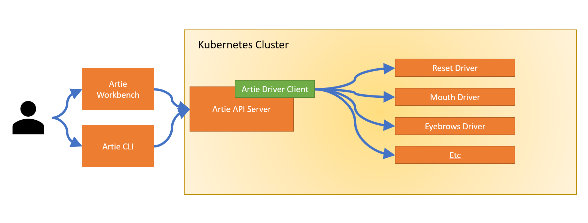

# Getting Started with Artie

Welcome to Artie! This guide will help you get started with your Artie robot.

## Prerequisites

You must have:

* An Artie robot that has been built and flashed with the firmware and OS images for the release you want to use.
    - [See here for instructions on how to do this](../building/building-artie-main.md)
* An admin server. This can be any computer that is on the same network as Artie.
    - [See here for instructions on how to install what you need on the admin server](./admin-server.md)
* Any additional computers you want to add to the Artie system.
    - [See here for instructions on how to install what you need on additional compute servers](./compute-server.md)
* A development machine. You already used this in the building guide. See [the building guide](../building/building-artie-main.md)
  for the requirements for this machine.

## Turn Artie on for the First Time

TODO: The following steps need to have screenshots.

It's now time to turn Artie on and configure him so that the admin server, your dev machine, and any
additional compute nodes can see him and interact with him.

1. Start Artie Workbench on your development machine by running `artie-workbench`.
1. Select `Artie` -> `Add New Artie` from the menu.
1. Follow the instructions in the wizard to set up Artie for the first time.

## Architecture

In case you are wondering, the flow of data here looks like this:

TODO: Replace this with a better (and more up-to-date) diagram.

The most important note here is that the only way into the Artie cluster (other than by directly
administering the Kubernetes cluster using its suite of tools) is through Artie Workbench (or Artie Tool,
which is the CLI version of Artie Workbench).

## Workload

Once you have all of your Artie components up and running and tested, it's time to decide how you want
to use Artie.

In general, you can use Artie for whatever you want, but going completely custom is probably overwhelming.
So consider these options:

* [Teleop](./teleop.md) - Controlling Artie's limbs and whatnot manually
* [Developmental Robotics Reference Stack](./deploy-artie-reference-stack.md) - The most up-to-date version of
  Artie mimicking human development.

## Uninstalling an Artie

TODO: Update to include deleting a Helm release on a specific Artie in a multi-Artie cluster.

To remove an Artie from your cluster, you can use Artie Workbench:

1. Open Artie Workbench.
1. Select `Artie` -> `Switch Artie` from the menu.
1. Select the Artie you want to uninstall and click `Delete Artie`.

To do it by means of Artie Tool, run the following commands instead:

1. `artie-tool deploy base --delete`
1. `artie-tool uninstall --artie-name <Your Artie's name>`

## Changing the Version of Artie Images

Updating images in your Artie deployment is straightforward in Artie Workbench.

To update the images used in your Artie deployment using Artie Tool, you can run:

1. `artie-tool deploy base --delete`
1. `artie-tool deploy base --chart-version <tag> [--deployment-repo <repo>]`
