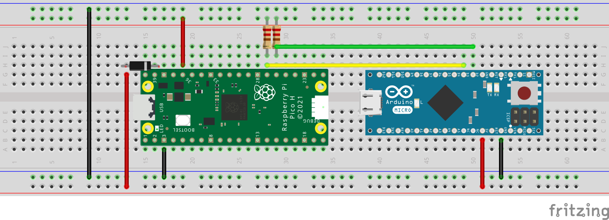

# Eyebrows FW Test: I2C

This test blinks the Pico's onboard LED based on commands received from a controller on I2C.

## Building and Running (Internal Test Version)
1. Connect two wires from: GP4 to GP6 and GP5 to GP7.
1. From this directory, run: `docker build -f Dockerfile --build-arg I2C=self -t artie-eyebrows-test-i2c:$(git log --format="%h" -n 1) .`
1. Now start that image in one process and in another,
   copy out the binaries with `docker cp <pid>:/pico/i2c-test/build/i2c_test.elf ./`
   and `docker cp <pid>:/pico/i2c-test/build/i2c_test.uf2 ./`
1. Plug the pico into the host computer *while holding down the onboard BOOTSEL button*. It should enumerate as a USB mass storage device.
1. Drag and drop the uf2 file into it.

## Building and Running (Arduino Micro Version)

1. From this directory, run: `docker build -f Dockerfile -t artie-eyebrows-test-i2c:$(git log --format="%h" -n 1) .`
1. Now start that image in one process and in another,
   copy out the binaries with `docker cp <pid>:/pico/i2c-test/build/i2c_test.elf ./`
   and `docker cp <pid>:/pico/i2c-test/build/i2c_test.uf2 ./`
1. Plug the pico into the host computer *while holding down the onboard BOOTSEL button*. It should enumerate as a USB mass storage device.
1. Drag and drop the uf2 file into it.
1. Unplug the Pico.
1. Build the Arduino program using the Arduino IDE, for an Arduino Micro.
1. Load the Micro with the program from the IDE.
1. Unplug the Micro.
1. Use the Fritzing diagram below to set up the test, **making sure to power the Arduino Micro over USB**. Use a Shotky diode
   to connect the voltage on the Pico. **Note** that the two voltage rails are different! One is 3.3V (for the I2C) and
   the other is 5V (for power supply). **Note** The resistors should be around 4.7k ohm.
1. The on board LED (on the Pico) should blink on for one second, then off for one second.

## Building and Running (RPi Version)

1. From this directory, run: `docker build -f Dockerfile -t artie-eyebrows-test-i2c:$(git log --format="%h" -n 1) .`
1. Now start that image in one process and in another,
   copy out the binaries with `docker cp <pid>:/pico/i2c-test/build/i2c_test.elf ./`
   and `docker cp <pid>:/pico/i2c-test/build/i2c_test.uf2 ./`
1. Plug the pico into the host computer *while holding down the onboard BOOTSEL button*. It should enumerate as a USB mass storage device.
1. Drag and drop the uf2 file into it.
1. Unplug the Pico.

TODO: Rpi i2c example